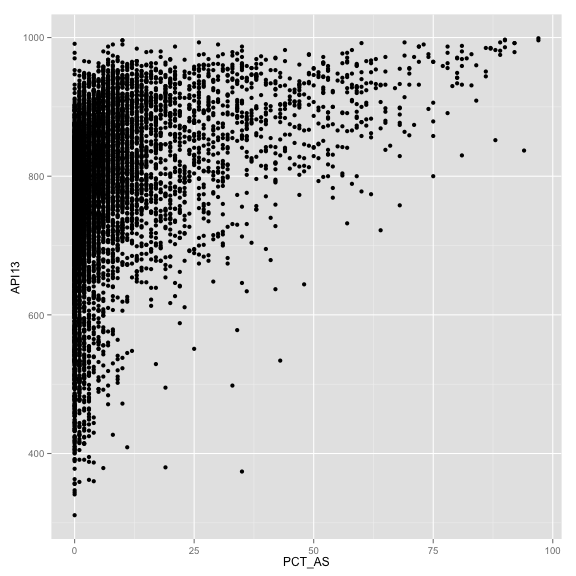
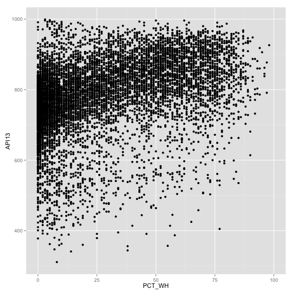
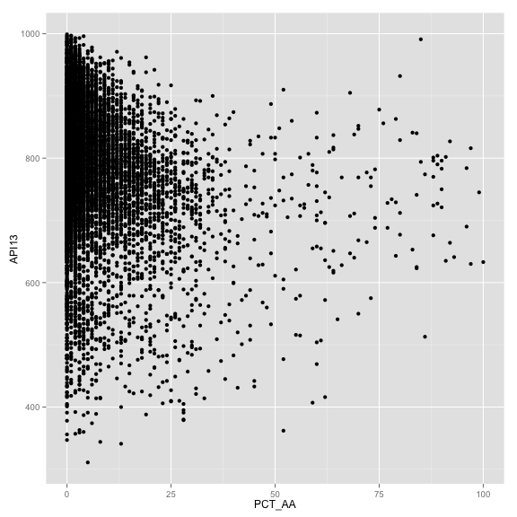

# Introduction

The report shows various relations between API score and the races.

# Script


```r
library(ggplot2)
```

```
## Loading required package: methods
```

```r
RACES <<- c("AA", "AI", "AS", "FI", "HI", "PI", "WH", "MR")

download_data_file <<- function() {
    ## Download 2013 Growth API file
    download.file(url="http://www3.cde.ca.gov/researchfiles/api/api13gtx.zip",
                  destfile="api13gtx.zip")
    ## Unzip it.
    unzip(zipfile="api13gtx.zip")
}

record_layout <<- function() {
    record_def <- read.csv("record_def.csv", header=FALSE)
    colnames(record_def) <- c("index",
                              "colname",
                              "type",
                              "fieldsize",
                              "description")

    ## Set some columns' class.
    numeric_column <-
        c("VALID",
          "API13",
          unlist(lapply(c("NUM", "API13"), function(score) paste(RACES, score, sep="_") ) ),
          paste("PCT", RACES, sep="_")
          )
    character_column <- c("SNAME")

    column_classes <- rbind(
        data.frame( colname=numeric_column, class="numeric", stringsAsFactors=FALSE),
        data.frame( colname=character_column, class="character", stringsAsFactors=FALSE))

    record_definition_table <- merge(record_def,
                                     column_classes,
                                     by="colname",
                                     all=TRUE,
                                     sort=FALSE)

    record_definition_table <- record_definition_table[order(record_definition_table$index),]
    record_definition_table[which(is.na(record_definition_table$class)), "class"] <- "character"

    return(record_definition_table)
}

school_data_frame <<- function() {
    download_data_file()

    record_definition_table <- record_layout()

    api13gtx <- read.fwf("api13gtx.txt",
                         width=record_definition_table$fieldsize,
                         col.names=record_definition_table$colname,
                         colClasses=record_definition_table$class, comment.char="")

    ## Clean up NA
    colnames_to_use_0_for_na <- c(paste(RACES, "NUM", sep="_"), "VALID")
    for (colname in colnames_to_use_0_for_na) {
        api13gtx[is.na(api13gtx[,colname]), colname] <- 0
    }

    school <- api13gtx[api13gtx$RTYPE == "S",]

    return(school)
}

school <- school_data_frame()

ggplot(school) + geom_point(aes(x=PCT_AS, y=API13))
```

```
## Warning: Removed 666 rows containing missing values (geom_point).
```

 

```r
ggplot(school) + geom_point(aes(x=PCT_WH, y=API13))
```

```
## Warning: Removed 666 rows containing missing values (geom_point).
```

 

```r
ggplot(school) + geom_point(aes(x=PCT_HI, y=API13))
```

```
## Warning: Removed 666 rows containing missing values (geom_point).
```

 

```r
ggplot(school) + geom_point(aes(x=PCT_PI, y=API13))
```

```
## Warning: Removed 666 rows containing missing values (geom_point).
```

 

```r
ggplot(school) + geom_point(aes(x=PCT_AA, y=API13))
```

```
## Warning: Removed 666 rows containing missing values (geom_point).
```

 

